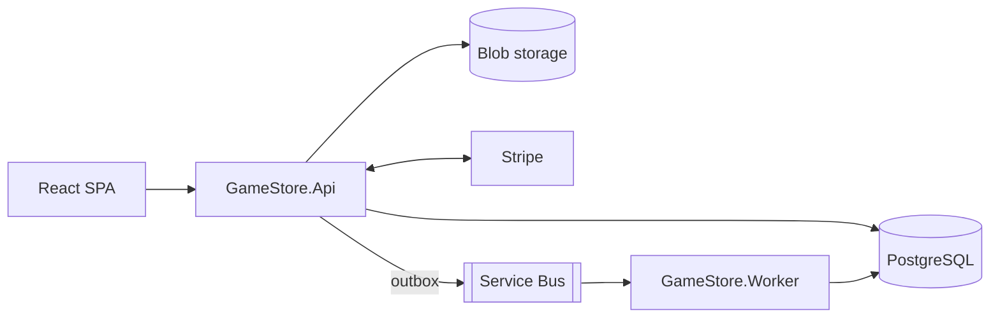

# Lootlark

Lootlark is a full-stack video game store: browse the catalog, fill a basket, pay with Stripe (test mode) and receive game codes once the order is processed. It is an ASP.NET Core API with a background worker, orchestrated locally with .NET Aspire, and a React front end.

The project was built by following the [.NET Academy](https://learn.dotnetacademy.io) .NET 8 bootcamp, and the code is kept close to the course's final trees. That is why the repository and the code keep the course's `GameStore.*` names (projects, namespaces, API routes, the Keycloak realm); Lootlark is the product name. Brand decisions and assets are in [docs/branding/](docs/branding/README.md).

Lootlark runs locally only. Nothing in this repository provisions or deploys cloud resources.

- [Features](#features)
- [Stack](#stack)
- [Prerequisites](#prerequisites)
- [Run locally](#run-locally)
- [Tests](#tests)
- [Continuous integration](#continuous-integration)
- [Repository layout](#repository-layout)
- [Documentation](#documentation)
- [Git workflow](#git-workflow)
- [Contributors](#contributors)
- [License](#license)

## Features

- Browse, search and filter games by genre; create, edit and delete games (Admin).
- Game cover images stored in blob storage (Azurite locally).
- A shopping basket per customer.
- Checkout with Stripe in test mode, idempotent per operation.
- Order processing through a transactional outbox, a Service Bus queue (the emulator locally) and a background worker that assigns game codes.
- Sign-in with Keycloak (Microsoft Entra ID is supported as an alternative).
- Traces, metrics and logs with OpenTelemetry, shown in the Aspire dashboard.

## Stack



| Part | Technology |
| --- | --- |
| Backend | .NET 8, ASP.NET Core minimal APIs, EF Core with PostgreSQL, Azure Service Bus client, Stripe.net |
| Local orchestration | .NET Aspire AppHost with PostgreSQL, pgAdmin, Azurite, the Service Bus emulator, Keycloak and the Stripe CLI as containers |
| Front end | React 18, TypeScript, Vite, Bootstrap, `oidc-client-ts`, Stripe.js |
| Tests | xUnit, FluentAssertions, NSubstitute, Moq, EF Core InMemory (unit); xUnit v3 and Testcontainers (integration) |
| CI | GitHub Actions |

| Project | Purpose |
| --- | --- |
| `GameStore.Api` | Minimal API: games, genres, baskets, orders, payments, Stripe webhook. |
| `GameStore.Data` | EF Core models, configurations, migrations and seeding (PostgreSQL). |
| `GameStore.Contracts` | Messages shared between the API and the worker. |
| `GameStore.Worker` | Consumes Service Bus messages and assigns game codes to paid orders. |
| `GameStore.ServiceDefaults` | Shared Aspire defaults: health checks, OpenTelemetry, resilience. |
| `GameStore.AppHost` | Aspire host that starts the whole backend locally. |
| `StripeCLI.Hosting` | Aspire hosting extension that runs the Stripe CLI as a container. |
| `frontend` | React + Vite single-page app, run with npm. |

## Prerequisites

- [.NET SDK](https://dotnet.microsoft.com/en-us/download) 8.0 or newer (no Aspire workload needed).
- [Docker Desktop](https://www.docker.com/products/docker-desktop/), running.
- [Node.js](https://nodejs.org/) 22 (the version CI uses, see [`.github/workflows/ci.yml`](.github/workflows/ci.yml)).
- A [Stripe](https://dashboard.stripe.com) account in **test mode**: a secret key (`sk_test_...`) and a publishable key (`pk_test_...`). Never use live keys.

## Run locally

The short version is below. [docs/local-development.md](docs/local-development.md) has the details: every parameter, what each container does, creating a Keycloak user, calling the API with a token, using Entra instead of Keycloak, cleaning up and troubleshooting.

1. Set the two required secrets (stored in .NET user-secrets, outside the repository):

   ```bash
   dotnet user-secrets set "Parameters:StripeApiKey" "sk_test_..." --project backend/src/GameStore.AppHost
   dotnet user-secrets set "Parameters:EntraAuthority" "https://login.microsoftonline.com/common/v2.0" --project backend/src/GameStore.AppHost
   ```

   The second value only has to be an HTTPS URL when you use Keycloak; with the committed placeholder every API request returns 500.

2. Start the backend. The first run pulls several container images.

   ```bash
   dotnet run --project backend/src/GameStore.AppHost --launch-profile http
   ```

   | Resource | URL |
   | --- | --- |
   | Aspire dashboard | http://localhost:15054 |
   | API | http://localhost:5082 |
   | Keycloak admin console | http://localhost:8080 |
   | pgAdmin | http://localhost:5050 |

3. Create a Keycloak user in the `gamestore` realm and give it the `Admin` role if it should manage games. The admin password is the `Parameters:keycloak-password` user secret. See [Create a Keycloak user](docs/local-development.md#create-a-keycloak-user).

4. Start the front end:

   ```bash
   cd frontend
   cp .env.example .env.local   # then set VITE_STRIPE_PUBLISHABLE_KEY=pk_test_...
   npm ci
   npm run dev
   ```

5. Open http://localhost:5173, sign in, add a game to the basket and check out with Stripe's test card `4242 4242 4242 4242` (any future expiry, any CVC). The order becomes **Completed** and shows its game codes.

Stop the AppHost with `Ctrl+C`. The database, storage, Service Bus emulator and Keycloak containers are persistent and keep their data.

## Tests

```bash
dotnet test backend/tests/GameStore.Api.UnitTests   # unit tests: fast, no Docker
dotnet test backend/Backend.sln                     # unit and integration tests: Docker must be running
```

- 82 unit tests (xUnit, FluentAssertions, NSubstitute, Moq, EF Core InMemory), one of them skipped on purpose.
- 23 integration tests against real PostgreSQL, Azurite and the Service Bus emulator, started by Testcontainers. The first run pulls the container images.
- Front end: `cd frontend && npm run lint && npm run build`.

## Continuous integration

[`.github/workflows/ci.yml`](.github/workflows/ci.yml) runs on GitHub Actions for every pull request to `devel` or `main` and every push to those branches:

| Job | What it checks |
| --- | --- |
| Backend build and unit tests | `dotnet build backend/Backend.sln` and the unit tests. |
| Backend integration tests | The integration tests, with Docker on the runner. |
| Front end lint and build | `npm ci`, `npm run lint` and `npm run build` in `frontend/`. |
| Commit messages | Pull requests only: every commit message is checked with commitlint against [`.commitlintrc.json`](.commitlintrc.json). |

## Repository layout

```text
.github/
  workflows/ci.yml              GitHub Actions CI
  pull_request_template.md      pull request template
backend/
  Backend.sln
  localinfra/                   Keycloak realm imported by the AppHost
  src/                          API, Data, Contracts, Worker, ServiceDefaults, AppHost, StripeCLI.Hosting
  tests/
    GameStore.Api.UnitTests/    unit tests
    GameStore.IntegrationTests/ integration tests (Testcontainers)
frontend/                       React app (npm, Vite)
docs/                           architecture, local development, glossary, branding
.commitlintrc.json              commit message rules
```

## Documentation

The index of all documents is [docs/README.md](docs/README.md):

- [Local development](docs/local-development.md): running, configuring and troubleshooting the app on your machine.
- [Architecture](docs/architecture.md): system context, local topology, flows, data model, security, CI and tests, with diagrams.
- [Glossary](docs/glossary.md): what Aspire, the outbox, Testcontainers, commitlint and the other tools and ideas are.
- [Branding](docs/branding/README.md): the Lootlark name, brand direction, logo files and design tokens.

## Git workflow

- `devel` is the default branch; every change goes through a pull request to `devel` that follows [the pull request template](.github/pull_request_template.md).
- Branch names: `feature/<name>` or `fix/<name>` (other conventional types such as `docs/<name>` or `ci/<name>` are used too).
- Commit messages follow [Conventional Commits](https://www.conventionalcommits.org): a type, a colon and one sentence in the imperative past tense, at most 100 characters and without a trailing full stop, for example `feat: Added the order history page`. The allowed types are listed in [`.commitlintrc.json`](.commitlintrc.json), and CI checks every pull request commit.

## Contributors

- [Axel Sanchez](https://github.com/Axeloooo)

## License

[MIT](LICENSE)
