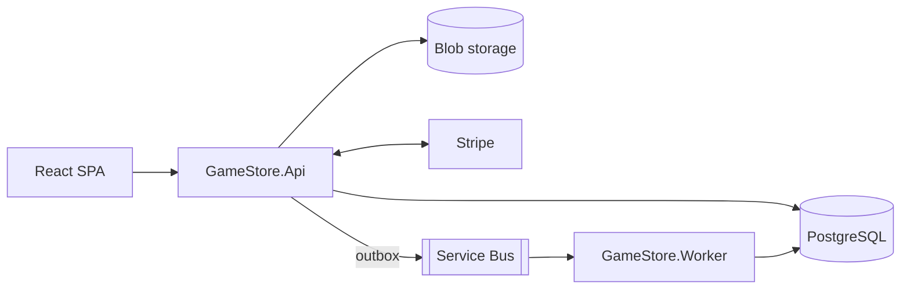

# Lootlark (repository: GameStore)

Lootlark is the product name of this project; the repository and the code keep the course's `GameStore.*` names (projects, namespaces, API routes, the Keycloak realm and the Stripe setup are unchanged). Brand decisions, assets and the naming record are in [docs/branding/](docs/branding/SUMMARY.md).

Lootlark is a full-stack video game store: an ASP.NET Core API with a background worker, orchestrated locally with .NET Aspire, and a React front end. It was built by following the [.NET Academy](https://learn.dotnetacademy.io) .NET 8 bootcamp, and the course code is kept as close to the course's final trees as possible.

## Documentation

A map of all documents is in [docs/README.md](docs/README.md): [architecture and system design](docs/architecture.md), a [glossary of tools and concepts](docs/glossary.md) (what Aspire, `azd`, the outbox and the like are), the [Azure deployment checklist](docs/deployment.md) and the [cloud runbooks](docs/runbooks/).

- [Features](#features)
- [Architecture](#architecture) (full design with diagrams: [docs/architecture.md](docs/architecture.md))
- [Repository Layout](#repository-layout)
- [Setup](#setup)
- [Run Locally](#run-locally)
- [Tests](#tests)
- [Cloud Deployment Runbooks](#cloud-deployment-runbooks) (deployment checklist: [docs/deployment.md](docs/deployment.md))
- [Troubleshooting](#troubleshooting)
- [Git Workflow](#git-workflow)
- [Branch Naming Convention](#branch-naming-convention)
- [Commit Message Convention](#commit-message-convention)
- [Contributors](#contributors)
- [License](#license)

## Features

- Browse, search and filter games by genre; create, edit and delete games (Admin).
- Game cover images stored in blob storage (Azurite locally, Azure Storage in the cloud).
- Shopping basket per customer.
- Checkout with Stripe (test mode), idempotent per operation.
- Order processing through a transactional outbox, Azure Service Bus (emulator locally) and a background worker that assigns game codes.
- Authentication with Keycloak locally and Microsoft Entra ID in the cloud.
- Observability with OpenTelemetry, optionally exported to Application Insights.

## Architecture

The full system design, with diagrams for the system context, the local and Azure topology, the checkout and order-fulfilment flow, the data model, security, the delivery pipeline and the test strategy, is in [docs/architecture.md](docs/architecture.md). In short: a React SPA calls an ASP.NET Core API that stores data in PostgreSQL and images in blob storage, takes payments through Stripe, and hands paid orders to a worker through a transactional outbox and Azure Service Bus.



| Project | Purpose |
| --- | --- |
| `GameStore.Api` | Minimal API: games, genres, baskets, orders, payments, Stripe webhook. |
| `GameStore.Data` | EF Core models, configurations, migrations and seeding (PostgreSQL). |
| `GameStore.Contracts` | Messages shared between the API and the worker. |
| `GameStore.Worker` | Consumes Service Bus messages and assigns game codes to paid orders. |
| `GameStore.ServiceDefaults` | Shared Aspire defaults: health checks, OpenTelemetry, resilience. |
| `GameStore.AppHost` | Aspire host that starts everything locally (and describes it for Azure). |
| `StripeCLI.Hosting` | Aspire hosting extension that runs the Stripe CLI as a container. |
| `GameStore.Frontend` | React + Vite single-page app. |
| `GameStore.Frontend.AppHost` | Separate Aspire host used to build and deploy the front end. |

## Repository Layout

```text
backend/
  Backend.sln
  azure.yaml                     azd project for the backend AppHost
  .azdo/pipelines/azure-dev.yml  Azure DevOps pipeline (Build, ParallelTesting, Deploy)
  localinfra/                    Keycloak realm imported by the AppHost
  src/                           API, Data, Contracts, Worker, ServiceDefaults, AppHost, StripeCLI.Hosting
  tests/
    GameStore.Api.UnitTests/     82 unit tests
    GameStore.IntegrationTests/  23 integration tests (Testcontainers)
    scripts/                     test slicing script used by the pipeline, load test script
frontend/
  GameStore.Frontend/            React app
  GameStore.Frontend.AppHost/    Aspire host for the front end
  React-Frontend.sln
docs/architecture.md             system design and diagrams
docs/deployment.md               ordered Azure deployment checklist (prepared, not executed)
scripts/deploy-preflight.sh      read-only pre-flight check before deploying
docs/runbooks/                   cloud steps that were intentionally not executed
```

## Setup

> [!IMPORTANT]
>
> If you are using Windows or Linux, install the following programs with the package manager of your operating system. The examples use Homebrew, the package manager for macOS.

Required:

- [.NET SDK](https://dotnet.microsoft.com/en-us/download) 8.0 or newer. The projects target `net8.0`; the Aspire packages come from NuGet, so no `aspire` workload is needed.
- [Docker Desktop](https://www.docker.com/products/docker-desktop/), running. The AppHost starts PostgreSQL, Azurite, the Service Bus emulator, Keycloak and the Stripe CLI as containers, and the integration tests use Testcontainers.
- [Node.js](https://nodejs.org/) 20 or newer (the course uses 22).
- A [Stripe](https://dashboard.stripe.com) account in **test mode**: a secret key (`sk_test_...`) and a publishable key (`pk_test_...`). Never use live keys.

Optional:

- [yamllint](https://yamllint.readthedocs.io) to validate the pipeline YAML (`brew install yamllint`).
- `az` and `azd` only if you follow the cloud runbooks.

### Secrets

Secrets live in .NET user-secrets, stored outside the repository, and are never committed. The committed `appsettings.json` files only contain placeholders.

```bash
# Stripe secret key, used by the API and by the Stripe CLI containers
dotnet user-secrets set "Parameters:StripeApiKey" "sk_test_..." --project backend/src/GameStore.AppHost

# The committed value is a placeholder, and the API refuses to start authentication with a
# non-HTTPS authority (every request returns 500). Locally Keycloak is used, so an HTTPS
# authority such as this one is enough:
dotnet user-secrets set "Parameters:EntraAuthority" "https://login.microsoftonline.com/common/v2.0" --project backend/src/GameStore.AppHost
```

Passwords for PostgreSQL, Keycloak and the Service Bus emulator are generated by Aspire on the first run and saved to the same user-secrets store.

## Run Locally

1. Start the backend. The first run pulls several container images, so it takes a while.

   ```bash
   dotnet run --project backend/src/GameStore.AppHost --launch-profile http
   ```

   | Resource | URL |
   | --- | --- |
   | Aspire dashboard | http://localhost:15054 |
   | API | http://localhost:5082 |
   | Keycloak admin console | http://localhost:8080 |
   | pgAdmin | http://localhost:5050 |

   The API health endpoints (`/health/ready`, `/health/alive`) are restricted by host: they answer only when the request host is exactly `localhost:5082` (the local API above) or any host on port 8081 (the port the Azure Container App probes use). Other hosts and ports, such as `https://localhost:7077`, get a 404 for these two paths.

2. Create a Keycloak user. The realm (`gamestore`) ships the clients, the `gamestore_api.all` scope and an `Admin` role, but no users. Sign in to the admin console (the admin password is the `Parameters:keycloak-password` user secret), create a user, set a password and assign the `Admin` realm role to be able to manage games. The first-time Keycloak setup is described in [docs/runbooks/azure-for-dotnet-developers.md](docs/runbooks/azure-for-dotnet-developers.md).

3. Start the front end.

   ```bash
   cd frontend/GameStore.Frontend
   cat > .env.local <<'EOF'
   VITE_BACKEND_API_URL=http://localhost:5082
   VITE_IDENTITY_PROVIDER=keycloak
   VITE_KEYCLOAK_AUTHORITY=http://localhost:8080/realms/gamestore
   VITE_KEYCLOAK_CLIENT_ID=gamestore-frontend-react
   VITE_KEYCLOAK_SCOPE=openid gamestore_api.all
   VITE_STRIPE_PUBLISHABLE_KEY=pk_test_...
   EOF
   npm ci
   npm run dev
   ```

   `.env.local` is git-ignored. Open http://localhost:5173, sign in, add a game to the basket and check out with Stripe's test card `4242 4242 4242 4242` (any future expiry, any CVC). The Stripe CLI container forwards the webhook to the API, the order becomes **Completed** and the worker assigns the game code.

4. Stop the AppHost with `Ctrl+C`. The Postgres, Azurite, Service Bus emulator and Keycloak containers are persistent, so they keep running and keep their data volumes. Remove them in Docker Desktop if you want a clean slate.

## Tests

```bash
dotnet test backend/Backend.sln                          # everything (Docker must be running)
dotnet test backend/tests/GameStore.Api.UnitTests        # unit tests only, fast, no Docker
```

- 82 unit tests (xUnit, FluentAssertions, NSubstitute, Moq), one of them skipped on purpose.
- 23 integration tests against real PostgreSQL, Azurite and the Service Bus emulator through Testcontainers. The first run pulls the container images.
- Pipeline YAML check: `yamllint -d '{extends: relaxed, rules: {new-lines: disable, line-length: disable}}' backend/.azdo/pipelines/azure-dev.yml`

## Cloud Deployment Runbooks

No cloud resources are provisioned from this repository. [docs/deployment.md](docs/deployment.md) is the ordered checklist for deploying to Azure with `azd` (what gets created, the order of operations and the values to collect), and `scripts/deploy-preflight.sh` is a read-only check of your machine, logins and secrets before you start. The cloud chapters of each course are documented as runbooks with parameterised commands (use your own values for every `<placeholder>`):

| Runbook | Covers |
| --- | --- |
| [azure-for-dotnet-developers.md](docs/runbooks/azure-for-dotnet-developers.md) | Entra, App Service, Storage, Front Door, Managed Identities, PostgreSQL, Key Vault, static web app. |
| [containers-and-aspire.md](docs/runbooks/containers-and-aspire.md) | Container Registry, Container Apps, `azd up`, Bicep Front Door, front-end deployment. |
| [payments-queues-workers.md](docs/runbooks/payments-queues-workers.md) | Stripe webhook endpoint, Service Bus, Key Vault secrets, deploys. Also the local deviations from the course. |
| [azure-devops-cicd.md](docs/runbooks/azure-devops-cicd.md) | Azure DevOps project, service connection, pipeline, parallel jobs. |
| [troubleshooting-azure.md](docs/runbooks/troubleshooting-azure.md) | Application Insights, load testing and diagnosing a slow endpoint. |

## Troubleshooting

- **Every API request returns 500 right after start:** `Parameters:EntraAuthority` is still the placeholder. Set it as shown in [Secrets](#secrets).
- **The API never starts and the dashboard shows `stripeSecretGen` failed:** the Stripe key is missing or invalid. The API waits for the Stripe CLI to generate the webhook secret.
- **PostgreSQL or Keycloak fails with `password authentication failed` after recreating containers:** a leftover data volume was initialised with another password. Remove the old `gamestore.apphost-*` containers and volumes (this deletes local development data only) and start again.
- **Webhooks return 400 or orders stay `Pending`:** make sure the Stripe CLI container is running and the key is a test key. The API accepts Stripe events of any API version (see the deviations in the payments runbook).
- **Integration tests report zero tests or hang:** Docker is not running or is still pulling images.

## Git Workflow

- The `devel` branch is the default branch.
- The `main` branch is the production branch.
- Every change goes through a pull request to `devel` that follows [PULL_REQUEST_TEMPLATE.md](PULL_REQUEST_TEMPLATE.md).
- Pull requests are not merged by hand. Reviewer agents (security and quality; the course reviewer too for course PRs) review the PR, and the orchestrator merges it once all of them approve and CI is green. Cloud spend, deleting remote branches or data and anything touching `main` still need the owner's explicit approval.

## Branch Naming Convention

- Feature branches should be named as `feature/<feature-name>`.
- Bugfix branches should be named as `fix/<bugfix-name>`.

The branch name should be in the following format:

```bash
git checkout -b feature/add-chapter-for-this-topic
```

## Commit Message Convention

The basic structure includes:

- `fix`: for bug fixes
- `feat`: for new features

The commit message should be in the following format:

```bash
git commit -m "feat: Added chapter for this topic"
```

## Contributors

- [Axel Sanchez](https://github.com/Axeloooo)

## License

[MIT](https://opensource.org/licenses/MIT)
