# Architecture and System Design

This document describes how GameStore is put together: the system context, the runtime topology (local and Azure), the backend structure, the main flows, the data model, security, delivery and testing. Diagrams use [Mermaid](https://mermaid.js.org), which GitHub renders directly.

Everything here describes what is in the repository. Cloud resources are not provisioned from it; the cloud topology is what the Aspire AppHost declares for `azd`, and the steps live in [runbooks](runbooks/).

## Contents

- [1. System context](#1-system-context)
- [2. Runtime topology](#2-runtime-topology)
- [3. Backend structure](#3-backend-structure)
- [4. Key flows](#4-key-flows)
- [5. Data model](#5-data-model)
- [6. Security](#6-security)
- [7. API surface](#7-api-surface)
- [8. Reliability and observability](#8-reliability-and-observability)
- [9. Delivery pipeline](#9-delivery-pipeline)
- [10. Testing strategy](#10-testing-strategy)
- [11. Design decisions](#11-design-decisions)

## 1. System context

Shoppers browse and buy games; administrators manage the catalog. The React app talks to the API, the API talks to its backing services, and a worker finishes paid orders asynchronously.

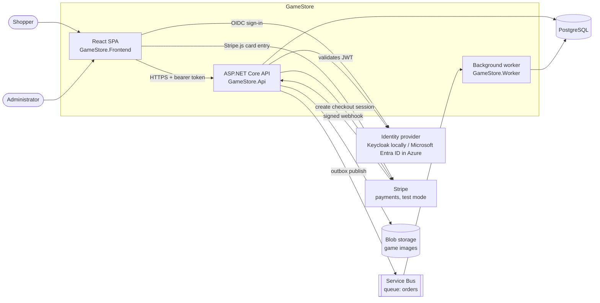

## 2. Runtime topology

### 2.1 Local (.NET Aspire)

`dotnet run --project backend/src/GameStore.AppHost` starts everything. Aspire orchestrates containers and .NET projects, injects connection strings, waits for dependencies and shows the result in a dashboard.

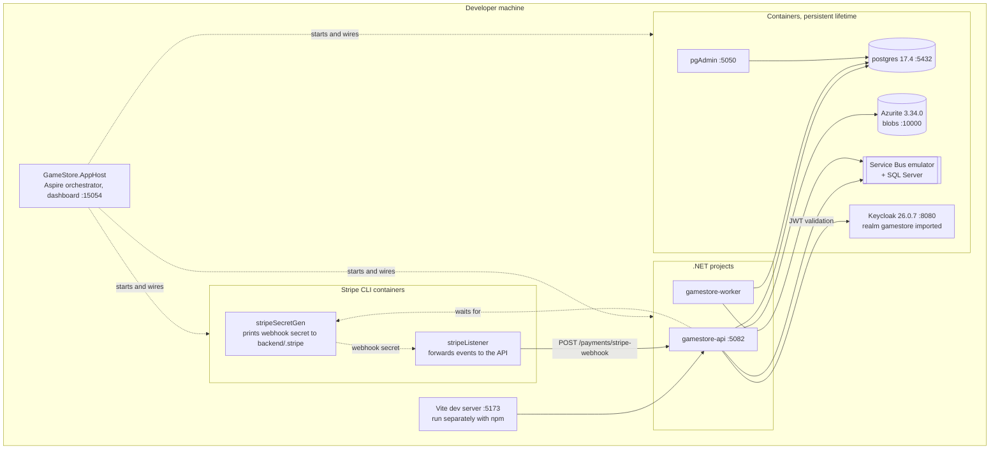

The Keycloak, Stripe CLI and local-emulator resources only exist in **run mode**. Passwords are generated by Aspire into user-secrets.

### 2.2 Azure (publish mode)

`azd up` (see [azure.yaml](../backend/azure.yaml) and the [runbooks](runbooks/)) turns the same AppHost model into Azure resources: the emulators are replaced by managed services.

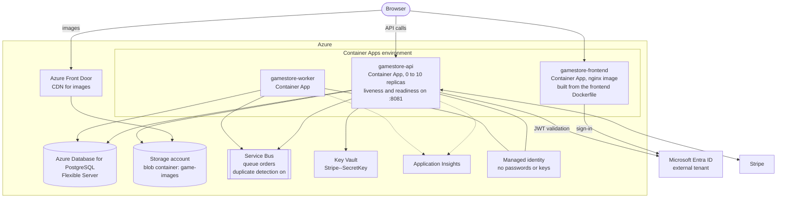

The React app is built from `frontend/GameStore.Frontend/Dockerfile` into an nginx image with the Vite settings baked in as build arguments (the Aspire frontend host was removed in LRN-283; locally the app runs with `npm run dev`, and deployment is on hold). The first course also covered hosting the built SPA on Azure Static Web Apps (`staticwebapp.config.json`); that option is described in the [first runbook](runbooks/azure-for-dotnet-developers.md).

Access to PostgreSQL, Storage, Service Bus and Key Vault goes through a `DefaultAzureCredential` (managed identity via `AZURE_CLIENT_ID`), so no connection secrets are stored. Application Insights is only wired in publish mode and only active when `APPLICATIONINSIGHTS_CONNECTION_STRING` is set.

## 3. Backend structure

The solution is split by responsibility; the API is organised in vertical feature slices.

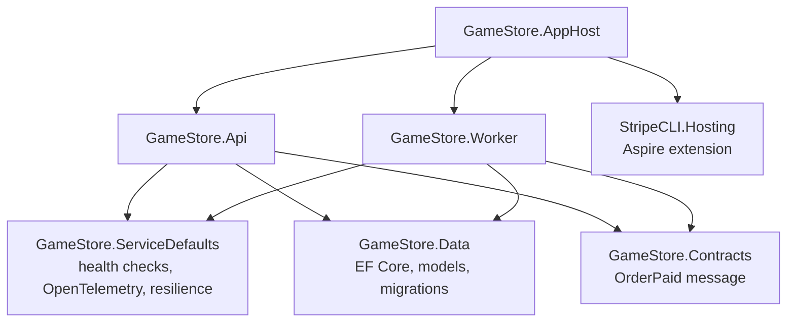

Inside `GameStore.Api`:

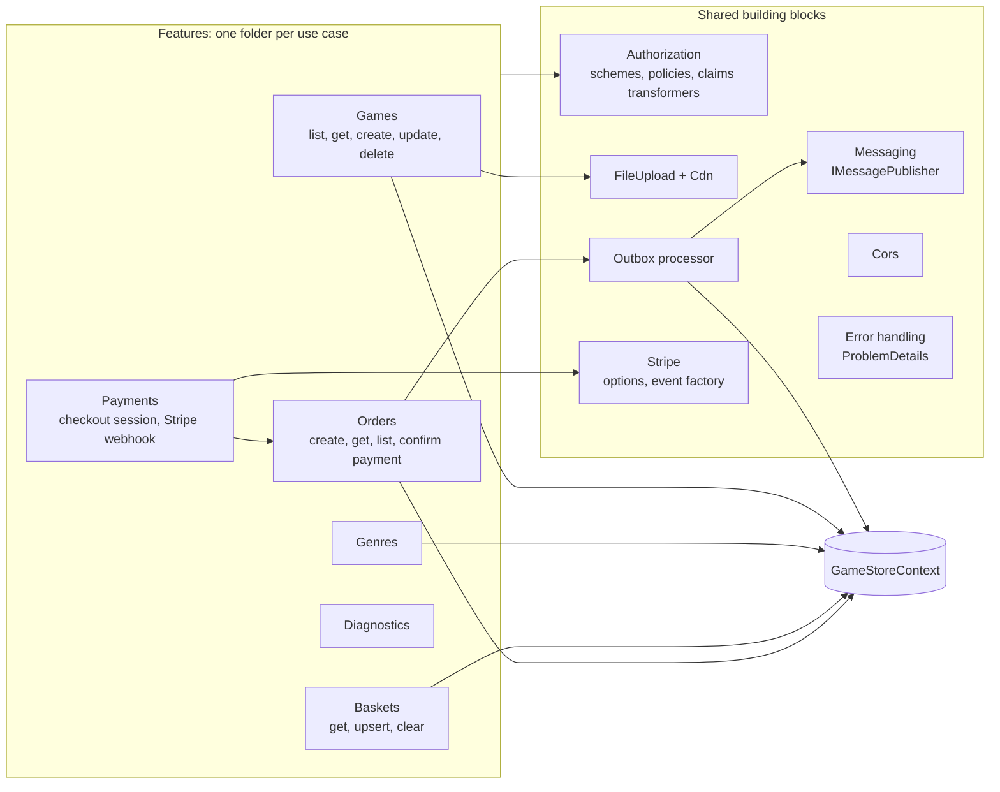

## 4. Key flows

### 4.1 Checkout and order fulfilment

This is the core flow. It is built to be safe against retries and crashes: the customer can double-click, Stripe can redeliver a webhook, and the API can crash between steps.

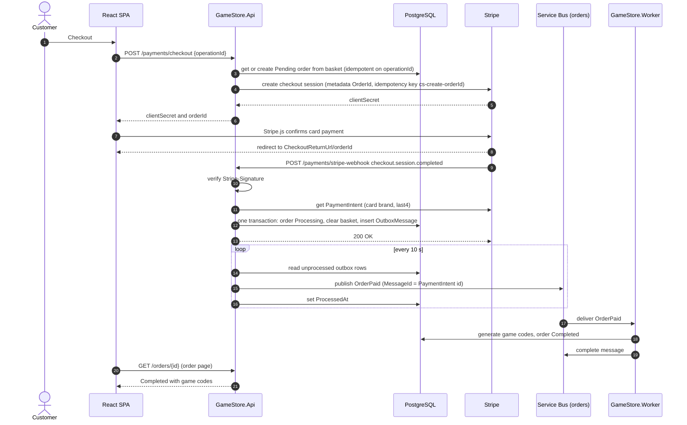

### 4.2 Order state machine

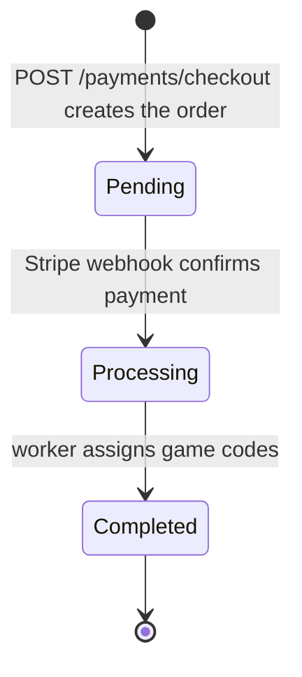

`ConfirmOrderPaymentOperation` ignores orders already `Processing` or `Completed`, so a redelivered webhook is a no-op.

### 4.3 Outbox and message handling

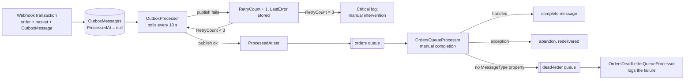

Writing the outbox row in the same database transaction as the state change means a message is never lost and never published for a rolled-back order. Publishing is at-least-once; the queue's duplicate detection (message id = PaymentIntent id) and the idempotent handlers absorb duplicates.

### 4.4 Image upload and CDN URLs

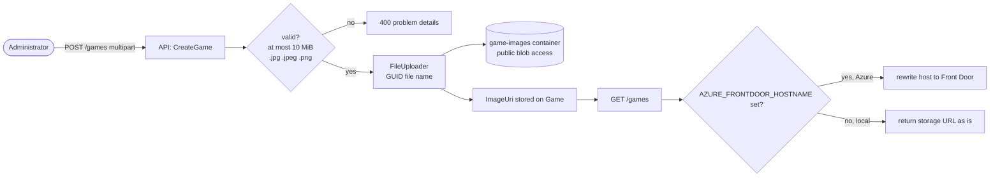

### 4.5 Sign-in and token validation

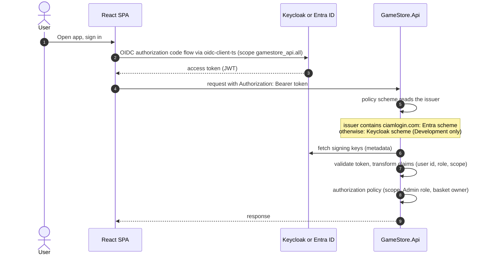

## 5. Data model

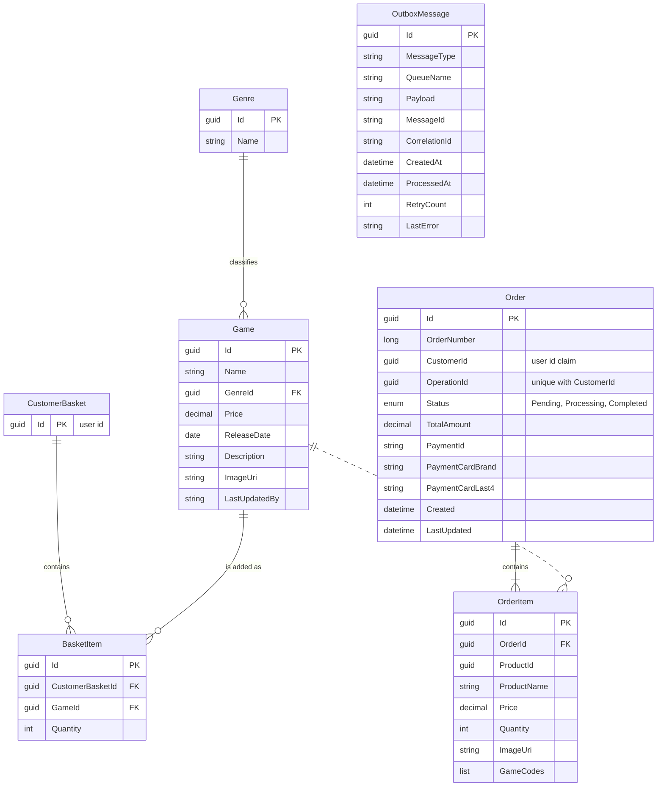

Notes:

- There is no user table: users live in the identity provider and are referenced by their id claim (`CustomerId`, basket id).
- `OrderItem` copies the product name, price and image at purchase time, so later catalog edits do not change past orders.
- A unique index on `(CustomerId, OperationId)` makes order creation idempotent; the race between two concurrent requests is resolved by catching the unique violation and returning the winning order.
- `OutboxMessage` has no relations: it is a generic transactional outbox.
- Migrations live in `GameStore.Data`; the API applies them and seeds genres on startup.

## 6. Security

| Concern | How it is handled |
| --- | --- |
| Authentication | JWT bearer. Keycloak (Development only) or Microsoft Entra ID; a policy scheme picks one by token issuer. |
| Authorization | Fallback policy `UserAccess`: every endpoint requires the `gamestore_api.all` scope unless marked anonymous. `AdminAccess` adds the `Admin` role (create, update and delete games). Baskets use a resource-based `OwnerOrAdminRequirement`. |
| Anonymous endpoints | `GET /games`, `GET /games/{id}`, `GET /genres`, and the Stripe webhook (protected by its signature instead). |
| Webhook integrity | `Stripe-Signature` is verified with the endpoint secret before any processing; events from any Stripe API version are accepted (a documented deviation, see [CLAUDE.md](../CLAUDE.md)). |
| Secrets | .NET user-secrets locally, Key Vault in production (`Stripe--SecretKey`). Cloud resource access uses managed identity. Nothing sensitive is committed. |
| CORS | Any origin in Development; in other environments only the `;`-separated `AllowedOrigins`, with `Authorization` and `Content-Type` headers. |
| Input handling | Upload size and extension limits, GUID blob names, `ProblemDetails` error responses through a global exception handler. |
| Payment data | Card data goes from the browser to Stripe directly; the API only stores brand and last four digits. |

## 7. API surface

| Method and path | Access | Purpose |
| --- | --- | --- |
| `GET /games` | anonymous | List and search games (paged). |
| `GET /games/{id}` | anonymous | Game details. |
| `POST /games` | Admin | Create a game with an image upload. |
| `PUT /games/{id}` | Admin | Update a game. |
| `DELETE /games/{id}` | Admin | Delete a game. |
| `GET /genres` | anonymous | List genres. |
| `GET /baskets/{userId}` | owner or Admin | Read a basket. |
| `PUT /baskets/{userId}` | owner or Admin | Replace a basket's items. |
| `POST /payments/checkout` | user | Create or reuse the order and a Stripe checkout session. |
| `POST /payments/stripe-webhook` | anonymous, signed | Receive Stripe events. |
| `GET /orders`, `GET /orders/{id}` | user | List and read orders. |
| `GET /diagnostics/nodeInfo` | user | Node information used in the troubleshooting course. |
| `GET /health/ready`, `GET /health/alive` | host-restricted | Readiness and liveness probes. |

## 8. Reliability and observability

| Topic | Design |
| --- | --- |
| Idempotent checkout | `operationId` from the client, unique `(CustomerId, OperationId)`, Stripe idempotency key `cs-create-{orderId}`. |
| Atomic payment confirmation | Order status, basket clearing and outbox row are written in one transaction (with an EF execution strategy for transient retries). |
| Reliable messaging | Transactional outbox, at-least-once publishing with duplicate detection, manual message completion, abandon on error, dead-letter queue with a logging processor. |
| Health | `/health/ready` and `/health/alive` from `ServiceDefaults`, restricted by host; Container Apps probes use port 8081. |
| Resilience | Standard resilience handler on outgoing HTTP clients (Aspire service defaults). |
| Scaling | API Container App scales from 0 to 10 replicas. Several API instances may each run the outbox processor, so a message can occasionally be published twice; the queue's duplicate detection (message id = PaymentIntent id) and the handlers' order-status check absorb the duplicates. |
| Telemetry | OpenTelemetry traces, metrics and logs (health checks excluded from tracing), exported to the Aspire dashboard locally and optionally to Application Insights. |

## 9. Delivery pipeline

[backend/.azdo/pipelines/azure-dev.yml](../backend/.azdo/pipelines/azure-dev.yml) runs on Azure DevOps (not executed from this repository; see the [runbook](runbooks/azure-devops-cicd.md)).

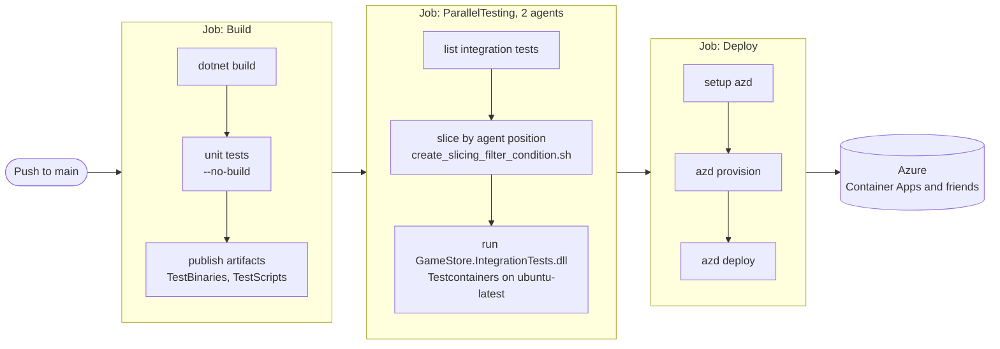

## 10. Testing strategy

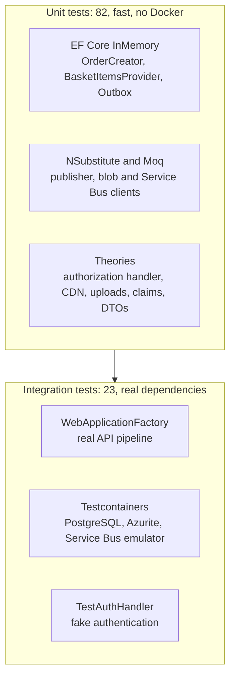

| Level | Project | Runs where |
| --- | --- | --- |
| Unit | `GameStore.Api.UnitTests` (xUnit, FluentAssertions, NSubstitute, Moq) | Everywhere, about two seconds. |
| Integration | `GameStore.IntegrationTests` (xUnit v3, Testcontainers) | Needs Docker; the pipeline slices it across two agents. |
| Manual end-to-end | Browser against the local AppHost with a Stripe test card | See the [README](../README.md#run-locally). |

## 11. Design decisions

| Decision | Reason | Trade-off |
| --- | --- | --- |
| Vertical feature slices in the API | Each use case is one folder with its endpoint, DTOs and handler; easy to navigate and extend. | Some shared logic (for example basket access) needs a shared home. |
| .NET Aspire AppHost | One command starts the whole stack locally and the same model produces the Azure deployment. | Requires Docker; the AppHost project reference model is Aspire specific. |
| Transactional outbox instead of publishing in the webhook | No lost or phantom messages when the API crashes between the database write and the bus. | Delay of up to the 10 s polling interval, at-least-once delivery. |
| Webhook returns quickly, fulfilment is asynchronous | Stripe retries slow webhooks; codes are generated by a separate worker. | Order page shows `Processing` until the worker finishes. |
| Idempotency at three levels | Client `operationId`, database unique index and Stripe idempotency key make double submits safe. | A few extra checks on the checkout path. |
| Two identity providers behind one policy scheme | Keycloak keeps local development independent of Azure while production uses Entra. | A small token-issuer switch in the API and two front-end configurations. |
| Managed identity everywhere in Azure | No passwords or connection secrets to store or rotate. | Local development uses emulators and generated passwords instead. |
| Course code kept verbatim | The repository mirrors the course, so it can be compared to the final trees. | A few intentional local deviations are tracked in [CLAUDE.md](../CLAUDE.md). |
| Cloud steps as runbooks | No cloud spend or credentials in the repository. | Runbook commands are written from the course and docs, not executed here. |
