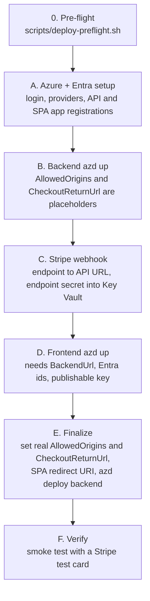

# Deploying GameStore to Azure

Status: **prepared, not executed.** Nothing in this repository has been deployed, and no cloud resource has been created. This is the ordered checklist for doing it with the Azure Developer CLI (`azd`). It ties together the five [runbooks](runbooks/), which hold the detailed, parameterised commands. New to `azd`, Aspire or Key Vault? See the [glossary](glossary.md). Replace every `<placeholder>` with your own value and never commit real values.

Cost warning: the deployment creates billable resources (see [What gets created](#what-gets-created)). Use a subscription you control, review the current Azure pricing for your region and plan to run `azd down` when you are done.

## Contents

- [What gets created](#what-gets-created)
- [Order of operations](#order-of-operations)
- [Before you start](#before-you-start)
- [Phase A: Azure and Entra setup](#phase-a-azure-and-entra-setup)
- [Phase B: first backend deploy](#phase-b-first-backend-deploy)
- [Phase C: Stripe webhook](#phase-c-stripe-webhook)
- [Phase D: frontend deploy](#phase-d-frontend-deploy)
- [Phase E: finalize and verify](#phase-e-finalize-and-verify)
- [Optional: CI/CD and monitoring](#optional-cicd-and-monitoring)
- [Teardown](#teardown)
- [Not verified](#not-verified)

## What gets created

`azd up` turns the AppHost model (`backend/src/GameStore.AppHost`) into Azure resources. The topology is drawn in [architecture.md](architecture.md#22-azure-publish-mode).

| Resource | Created by | Notes |
| --- | --- | --- |
| Resource group, Container Apps environment, container registry | `azd` | One environment per `azd env`. |
| `gamestore-api` Container App | backend AppHost | Scales 0 to 10 replicas; probes on port 8081. |
| `gamestore-worker` Container App | backend AppHost | Consumes the `orders` queue. |
| Azure Database for PostgreSQL Flexible Server | backend AppHost | Database `gamestore`. A main fixed cost. |
| Storage account (blob) | backend AppHost | Public blob access for game images. |
| Service Bus namespace and `orders` queue | backend AppHost | Duplicate detection enabled. |
| Key Vault | backend AppHost (publish mode) | `Stripe--SecretKey`; you add the webhook endpoint secret. |
| Azure Front Door profile | `bicep/frontdoor.bicep` | CDN in front of blob storage. A main fixed cost. |
| Application Insights | backend AppHost (publish mode) | Telemetry once the connection string is injected. |
| `gamestore-frontend` Container App | frontend AppHost (`frontend/`) | nginx image with the Vite settings baked in at build time. |

Created by hand, outside `azd`: the Microsoft Entra external tenant and its two app registrations (API and SPA), and the Stripe webhook endpoint.

## Order of operations

The services depend on each other's URLs, so deployment takes several passes: the Stripe webhook needs the API URL, and CORS plus the Entra redirect need the frontend URL.



## Before you start

Install and sign in (the pre-flight script reports each of these):

| Need | How |
| --- | --- |
| Azure CLI (`az`) | `brew install azure-cli`; then `az login --tenant <tenant-id>` and `az account set --subscription <subscription-id>`. |
| Azure Developer CLI (`azd`) | See the [install guide](https://learn.microsoft.com/azure/developer/azure-developer-cli/install-azd); then `azd auth login --tenant-id <tenant-id>`. |
| `az` extension | `az extension add --name containerapp` (runbook commands use it). |
| Docker | Running, for image builds. |
| .NET SDK 8+, Node 20+ | Already required for local development. |
| An Azure subscription | Where you can create resources and app registrations. |
| A Stripe account in **test mode** | Secret key (`sk_test_...`), publishable key (`pk_test_...`). Never use live keys. |

Run the pre-flight check; it is read-only and never prints IDs or secret values:

```bash
scripts/deploy-preflight.sh          # tools, logins, providers, secrets, repository state
scripts/deploy-preflight.sh --full   # also builds the solution and runs the unit tests
```

Values to collect up front (all go into prompts, user-secrets or Key Vault, never into git):

| Value | Where it comes from | Used as |
| --- | --- | --- |
| Tenant id, subscription id, location | Azure | `azd env set AZURE_SUBSCRIPTION_ID`, `AZURE_LOCATION`; login commands |
| `<entra-api-client-id>` | API app registration (Phase A) | AppHost parameter `EntraValidAudience` |
| `https://<entra-tenant-id>.ciamlogin.com/<entra-tenant-id>/v2.0` | Entra external tenant | AppHost parameter `EntraAuthority`; frontend `EntraAuthority` |
| `<entra-spa-client-id>`, API scope | SPA app registration (Phase A) | Frontend `EntraClientId`, `EntraScope` |
| `<stripe-test-secret-key>` | Stripe Dashboard, test mode | AppHost parameter `StripeApiKey` (secret, stored in Key Vault) |
| `<stripe-test-publishable-key>` | Stripe Dashboard, test mode | Frontend `StripePublishableKey` |
| `<stripe-webhook-secret>` | Stripe webhook endpoint (Phase C) | Key Vault secret `Stripe--EndpointSecret` |

## Phase A: Azure and Entra setup

1. Sign in and register the resource providers: [payments runbook, step 0](runbooks/payments-queues-workers.md#0-login-and-variables). The list in that runbook is inferred; `scripts/deploy-preflight.sh` shows which providers are not registered yet.
2. Create the Entra external tenant and the two app registrations (API with the `gamestore_api.all` scope and the `Admin` app role, and SPA): [first runbook, step 3](runbooks/azure-for-dotnet-developers.md#3-microsoft-entra-external-tenant-and-app-registrations-portal--cli). Some steps are portal-only (exposing the scope, the role, token version, consent, sign-up user flow).

## Phase B: first backend deploy

From `backend/` (details: [containers runbook, step 6](runbooks/containers-and-aspire.md#6-aspire-iac-with-azd-backend) and [payments runbook, step 4](runbooks/payments-queues-workers.md#4-backend-deploy-azd--container-apps--front-door)):

```bash
cd backend
azd auth login --tenant-id <tenant-id>
azd env new <azd-env-name>
azd env set AZURE_SUBSCRIPTION_ID <subscription-id>
azd env set AZURE_LOCATION <location>
azd up
```

`azd up` prompts for the AppHost parameters; the frontend URL is not known yet, so use placeholders for the two origins:

| Parameter | First pass | Final value (Phase E) |
| --- | --- | --- |
| `EntraValidAudience` | `<entra-api-client-id>` | same |
| `EntraAuthority` | `https://<entra-tenant-id>.ciamlogin.com/<entra-tenant-id>/v2.0` | same |
| `AllowedOrigins` | `http://localhost:5173` | `https://<frontend-container-app-fqdn>` |
| `CheckoutReturnUrl` | `http://localhost:5173/order-created` | `https://<frontend-container-app-fqdn>/order-created` |
| `StripeApiKey` (secret) | `<stripe-test-secret-key>` | same |

`azd` writes the answers to `backend/.azure/<azd-env-name>/` (git-ignored; never commit it). Note the API address azd prints: `<container-app-fqdn>`.

Expect the API revision to be **unhealthy after this first pass**. `StripeOptions` marks `EndpointSecret` as required and validates it on start (`ValidateOnStart`), and nothing in the AppHost creates that value in the cloud, so the API cannot start until Phase C adds the Key Vault secret `Stripe--EndpointSecret`. The Container App address exists from provisioning, so Stripe can already be pointed at it. Whether `azd up` itself reports success while the revision is failing its probes is not verified; if it stops with an error, continue with Phase C and then run `azd deploy` again.

## Phase C: Stripe webhook

1. In the Stripe Dashboard (test mode), add a webhook endpoint `https://<container-app-fqdn>/payments/stripe-webhook` for the `checkout.session.completed` event and copy its signing secret: [payments runbook, step 1](runbooks/payments-queues-workers.md#1-stripe-webhook-endpoint-after-the-api-is-deployed-step-4). The API accepts events of any Stripe API version (see the deviations in that runbook).
2. Store the signing secret as the Key Vault secret `Stripe--EndpointSecret` (the AppHost only creates `Stripe--SecretKey`) and restart the API revision: [payments runbook, step 3](runbooks/payments-queues-workers.md#3-key-vault-secrets-stripe). This is what lets the API start (see the note in Phase B).
3. Check reachability: `curl -i -X POST https://<container-app-fqdn>/payments/stripe-webhook` should answer 400 (no signature).

## Phase D: frontend deploy

From `frontend/`, using the frontend AppHost ([payments runbook, step 5](runbooks/payments-queues-workers.md#5-front-end-deploy-stripepublishablekey) and [containers runbook, step 9](runbooks/containers-and-aspire.md#9-front-end-with-aspire)):

```bash
cd frontend
azd env new <azd-env-name-frontend>
azd up      # BackendUrl, EntraClientId, EntraAuthority, EntraScope, StripePublishableKey
```

`BackendUrl` is `https://<container-app-fqdn>`. The publishable key is baked into the bundle through the Docker build argument `VITE_STRIPE_PUBLISHABLE_KEY`; it is a public value. Note the printed `<frontend-container-app-fqdn>`.

## Phase E: finalize and verify

1. Add the SPA redirect URI `https://<frontend-container-app-fqdn>/authentication/callback` to the SPA app registration ([payments runbook, step 6](runbooks/payments-queues-workers.md#6-entra-values-to-update)).
2. Set the real `AllowedOrigins` and `CheckoutReturnUrl` (table in Phase B) and redeploy the backend:

   ```bash
   cd backend
   azd env set AllowedOrigins https://<frontend-container-app-fqdn>   # or answer the prompts again
   azd deploy
   ```

3. Smoke test ([payments runbook, step 7](runbooks/payments-queues-workers.md#7-smoke-test)):
   - Open `https://<frontend-container-app-fqdn>`, sign in, add a game to the basket and check out with the test card `4242 4242 4242 4242`.
   - In the Stripe Dashboard the webhook endpoint shows a `200` delivery.
   - The order becomes `Completed` and shows its game code; the outbox row is processed and the worker logged the message (`az containerapp logs show -g <resource-group> -n <worker-container-app-name> --follow`).
   - Game images load through the Front Door host (the API rewrites storage URLs when `AZURE_FRONTDOOR_HOSTNAME` is set).

## Optional: CI/CD and monitoring

- **Azure DevOps pipeline** (`backend/.azdo/pipelines/azure-dev.yml`): the course pipeline assumes the solution is at the repository root, but it lives in `backend/`, and the trigger is `main` while the default branch is `devel`. The fix and the project, service connection, variable and parallel-jobs setup are in the [CI/CD runbook](runbooks/azure-devops-cicd.md).
- **Application Insights**: `azd` provisions it and injects `APPLICATIONINSIGHTS_CONNECTION_STRING`; investigation steps and load tests are in the [troubleshooting runbook](runbooks/troubleshooting-azure.md).

## Teardown

```bash
cd frontend && azd down      # use --purge to also purge soft-deleted resources such as Key Vault
cd ../backend && azd down
```

The Entra tenant, app registrations and Stripe webhook endpoint were created by hand and must be removed by hand.

## Not verified

The runbooks are written from the repository, the course material and the Azure CLI documentation. None of the cloud commands were run. In particular these points are inferences to confirm during the first real deployment:

- The exact `azd env set` names for AppHost parameters (the pipeline passes `AZURE_ENTRA_VALID_AUDIENCE`, `AZURE_ENTRA_AUTHORITY`, `AZURE_ALLOWED_ORIGINS`, `AZURE_CHECKOUT_RETURN_URL` and `AZURE_STRIPE_API_KEY` to `azd`, which suggests the naming, but answering the prompts once is the safe path).
- Whether Aspire assigns every managed-identity role automatically (PostgreSQL, Storage, Service Bus, Key Vault); the runbooks list what to check.
- The Key Vault secret name `Stripe--EndpointSecret` (derived from the options class).
- Whether `azd up` completes while the first API revision is unhealthy (missing `Stripe--EndpointSecret`), and how Aspire surfaces that failure.
- The list of resource providers that need registering.
- The Application Insights wiring pairs Aspire 9.5.2 packages with `Aspire.Hosting.Azure.ApplicationInsights` 13.0.0; it builds, but a version-skew problem would first show up during `azd provision`.
